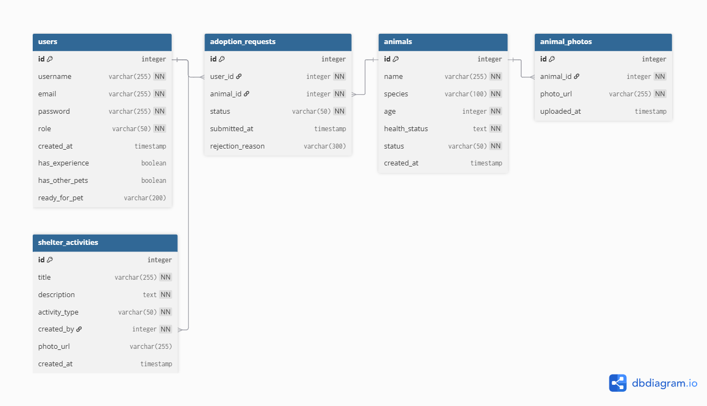

# PawShelter
## Описание
Приложение представляет собой веб-платформу для управления приютом для животных. Пользователи могут просматривать список животных, подавать заявки на усыновление, а администраторы и волонтёры управлять животными и их данными. Система поддерживает роли пользователей с гибкой моделью контроля доступа RBAC (role-based access control).

Функционал включает:
* Животные: добавление, редактирование и удаление животных; отслеживание здоровья, возраста и статуса; прикрепление фотографий.
* Заявки на усыновление: подача, просмотр и управление статусом заявок (ожидает, одобрено, отклонено); возможность оформления возврата животного при неудачном усыновлении.
* Активности приюта: создание и ведение ленты событий, включая кормление, лечение, уход за животными, новости и мероприятия; просмотр активностей всеми пользователями; добавление записей только волонтёрами и администраторами.
* Поиск и фильтрация: по виду животного.
* Разграничение прав доступа по ролям.

 ## Наименование
 **PawShelter** - название отражает основной функционал приложения: управление приютом для животных и процессом усыновления.

 ## Предметная область
 Система предназначена для учета животных в приюте, управления пользователями с различными ролями, ведения заявок на усыновление и ленты событий приюта. Основные сущности: пользователи, животные, заявки, фотографии животных, активности приюта. Система обеспечивает контроль за животными, прозрачность процесса усыновления и разграничение прав доступа.

 ## Данные
 ### Пользователь:
* Имя (username) - обязательное, уникальное
* Email (email) - обязательное, уникальное, корректный формат
* Пароль (password) - обязательное, захэшированное
* Роль (role) - admin, volunteer, adopter; по умолчанию adopter
* Дата регистрации (created_at) - автоматически
* Анкета усыновителя (только для роли adopter):
  - Опыт содержания животных (has_experience) — да/нет, необязательное  
  - Другие питомцы (has_other_pets) — да/нет, необязательное  
  - Готовность к питомцу (ready_for_pet) — короткий текст, необязательное  
* После авторизации пользователь может выполнять действия в зависимости от своей роли.
### Животные:
* Имя (name) - обязательное
* Вид (species) - обязательное, например кошка, собака
* Возраст (age) - обязательное, ≥ 0
* Описание здоровья (health_status) - обязательное
* Статус (status) - обязательное, in_shelter или adopted
* Дата добавления (created_at) - автоматически
### Заявки на усыновление:
* Пользователь (user_id) - ссылка на пользователя
* Животное (animal_id) - ссылка на животное
* Статус (status) - pending, approved, rejected, returned; по умолчанию pending
* Дата подачи (submitted_at) - автоматически
* Причина отклонения (rejection_reason) — текстовое поле, необязательное

### Фотографии животных:
* Животное (animal_id) - ссылка на животное
* URL фотографии (photo_url) - обязательное
* Дата загрузки (uploaded_at) - автоматически
### Активности приюта:
Записи о событиях и активности приюта представляют собой хронологические записи действий и мероприятий, связанных с уходом за животными и жизнью приюта.  
Примеры записей: кормление, медицинский осмотр, уборка, новости, советы по уходу, различные мероприятия. 
* Название (title) - обязательное
* Описание (description) - обязательное
* Тип (activity_type) - обязательное
* Создатель (created_by) - обязательная ссылка на пользователя, который создал запись
* Опциональное фото (photo_url) - URL или путь к фотографии активности
* Дата создания (created_at) - автоматически подставляется при создании записи
### Возвраты животных (Returns):
Возвраты фиксируют случаи, когда усыновление не состоялось или животное было возвращено в приют.
* Усыновление (adoption_id) — ссылка на заявку, по которой было одобрено усыновление
* Причина возврата (reason) — текстовое поле, необязательное
* Дата возврата (returned_at) — автоматически
* Обработал (processed_by) — ссылка на пользователя с ролью admin или volunteer
  
При возврате:
 - Заявка получает статус returned
 - Животное переводится в статус in_shelter
 - Животное снова становится доступным для усыновления
  
# Для каждого элемента данных - ограничения:
* Имя пользователя (username) - уникальное
* Email пользователя (email) - уникальный и корректный
* Пароль (password) - минимум 6 символов, должна быть хотя бы одна заглавная буква
* Анкета усыновителя (для роли adopter):
  - has_experience — да/нет, необязательное
  - has_other_pets — да/нет, необязательное
  - ready_for_pet — текстовое поле, необязательное
* Имя животного (name) - обязательное
* Возраст животного (age) - ≥ 0
* Статус животного (status) - только in_shelter или adopted
* Заявка на усыновление:
  - Один пользователь не может подать более одной активной заявки на одного и того же питомца
  - При отклонении заявки можно указать причину (rejection_reason), необязательное поле
* Фото животных (photo_url) - только форматы .jpg и .png
* Активность приюта (activity_type) - только допустимые типы: feeding, medical, cleaning, event, news, advice
* Создание/редактирование активности - только администраторы и волонтёры
* Просмотр активности - все пользователи

# Схема баз данных

# Общие ограничения целостности
* Валидация данных - проверка корректности всех полей (уникальность, форматы, диапазоны значений и т.д.)
* Ограничения доступа по ролям - определение, какие действия доступны каждой роли (Admin, Volunteer, Adopter)
* При возврате животного должна сохраняться ссылка на исходную заявку, чтобы отслеживать историю усыновлений.

# Пользовательские роли
### Adopter (усыновитель)
* Просмотр списка животных и информации о них
* Поиск и фильтрация: по виду животного
* Подача заявок на усыновление
* Просмотр ленты активностей приюта
### Volunteer (волонтёр)
* Добавление, редактирование и удаление информации о животных
* Загрузка и прикрепление фотографий животных
* Создание и редактирование активностей приюта: feeding, medical, cleaning, event, news, advice
* Просмотр всех записей и ленты активностей
* Просмотр заявок на усыновление
### Admin (администратор)
* Полный доступ ко всем данным и функциям системы
* Управление пользователями: создание, редактирование, удаление
* Контроль и управление активностями приюта
* Просмотр и модерация всей информации

# User stories
### Роль: Усыновитель (Adopter)
* Просматривает список животных и карточки с их описанием, чтобы выбрать питомца для усыновления.
* Может подать заявку только на животное со статусом in_shelter.
* Может заполнять анкету усыновителя с указанием опыта, наличия других питомцев и готовности к животному; эти данные видны администратору при рассмотрении заявки.
* Не может иметь более одной активной заявки на одного и того же питомца.
* Может отслеживать статус своей заявки (pending, approved, rejected).
* В случае, если его заявка одобрена, животное получает статус adopted и становится недоступным для новых заявок.
* Если заявку одобрил другой пользователь, все остальные активные заявки на это животное автоматически переводятся в статус rejected, а карточка животного остаётся доступной только для просмотра.

### Роль: Волонтёр (Volunteer)
* Добавляет и редактирует карточки животных, чтобы поддерживать актуальность информации.
* Прикрепляет фотографии животных.
* Создаёт и редактирует записи о событиях и активности приюта.
* Может просматривать все заявки на усыновление, но не изменять их статус.

### Роль: Администратор (Admin)
* Управляет заявками на усыновление: одобряет или отклоняет их. При отклонении заявки может указать причину отклонения (rejection_reason).
* При одобрении заявки животное автоматически переводится в статус adopted, а все остальные активные заявки на это животное отклоняются.
* При отклонении заявки животное остаётся доступным для других усыновителей.
* Управляет пользователями: создаёт, редактирует и удаляет аккаунты, назначает роли.
* Имеет полный доступ к данным о животных, фотографиям и активности приюта.
* Может оформлять возврат животных в приют (в случае, если усыновление не состоялось). При этом животное переводится в статус in_shelter, а заявка получает статус returned.

# UI / API
Публичный сайт для просмотра животных, подачи заявок и ведения активности приюта; backend на Django с Django REST Framework, REST API для взаимодействия фронтенда и сервера.

# Технологии разработки

# Язык программирования
* Python 3.13.1

# СУБД
* PostgreSQL

# Тестирование 
* Unit-тесты: проверка логики работы приложения (CRUD для животных, заявок, активностей и пользователей) с использованием pytest.
* Тестирование безопасности и доступа: проверка, что роли пользователей (Adopter, Volunteer, Admin) имеют только свои разрешенные действия; предотвращение несанкционированного доступа к данным и функциям.
